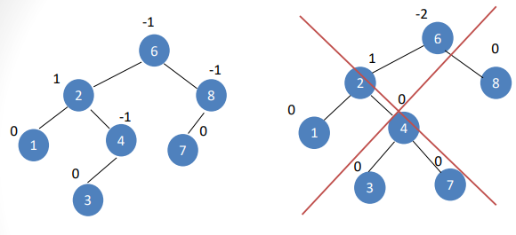

# RESUMEN LIBRO LISTS, STACKS AND QUEUES

## 4 ARBOLES 

### ¿Que es un "Arbol"?

El Arbol en terminos generales es una estructura de datos no lineales, es decir que estos no siguen una secuencia directa. como lo haria una lista, en las lista secuenciales se puede tener una flexibilidad sobre las representaciones contiguas. 

A diferencia de las estructuras de datos no lineales cada elemento puede tener diferentes secuencias, una desendiente de otra.

## 4.1 PRELIMINARES

### Las definiciones a tener en cuenta son:

**Raíz** del árbol. Todos los árboles que no están vacíos tienen un único nodo raíz. Todos los demás elementos o nodos se derivan o descienden de él. El nodo raíz no tiene padre – es decir, no es el hijo de ningún elemento.

**Nodo** son los vértices o elementos del árbol.

**Nodo terminal u hoja** (leaf node) es aquel nodo que no contiene ningún subárbol.
A cada nodo que no es hoja se asocia uno o varios subárboles llamados 

**Descendientes** (offspring) o hijos. De igual forma tiene asociado un antecesor o ascendiente llamado padre.

Los nodos de un mismo padre se llaman **hermanos**.

Los nodos con uno o dos subárboles – no son hojas ni raíz – se llaman **nodos interiores o internos**.

Una colección de dos o más árboles se llama bosque **forest**.

*Todos los nodos tienen un solo padre – excepto la raíz – que no tiene padre.*

Se denomina **camino** el enlace entre dos nodos consecutivos, y rama es un camino que termina en una hoja.

*Cada nodo tiene asociado un número de nivel que se determina por la longitud del camino desde la raíz al nodo específico.*

*La altura o profundidad de un árbol es el número máximo de nodos de una rama. Equivale al nivel más alto de los nodos más uno. El peso de un árbol es el número de nodos terminales.*

### ARBOLES BINARIOS
 
Para explicar un arbol, necesitamos conocer ademas de su composicion, tambien como se puede representar, los arboles requieren de punteros que nos permitan ubicar las posiciones de cada nodo, en cada rama

### ÁRBOL BINARIO AUTO-BALANCEABLES

En ciencias de la computación, un árbol binario de búsqueda auto-balanceable o equilibrado es un árbol binario de búsqueda que intenta mantener su altura, o el número de niveles de nodos bajo la raíz, tan pequeños como sea posible en todo momento, automáticamente. Esto es importante, ya que muchas operaciones en un árbol de búsqueda binaria tardan un tiempo proporcional a la altura del árbol, y los árboles binarios de búsqueda ordinarios pueden tomar alturas muy grandes en situaciones normales, como cuando las claves son insertadas en orden. Mantener baja la altura se consigue habitualmente realizando transformaciones en el árbol, como la rotación de árboles, en momentos clave.

Tiempos para varias operaciones en términos del número de nodos en el árbol n:

*Operación*	Tiempo en cota superior asintótica

*Búsqueda*	O(log n)

*Inserción*	O(log n)

*Eliminación*	O(log n)

*Iteración en orden*	O(n)

Para algunas implementaciones estos tiempos son el peor caso, mientras que para otras están amortizados.

### GENERALIDADES

Un árbol binario es un conjunto finito de cero o más nodos tales que:
Existe un nodo denominado raíz del árbol.
Cada nodo puede tener 0, 1 ó 2 subárboles, conocidos como subárbol izquierdo y subárbol derecho.

### RECORRIDO DE UN ARBOL

Se denomina recorrido de un árbol al proceso que permite acceder de una sola vez a cada uno de los nodos del árbol. Cuando un árbol se recorre, el conjunto completo de nodos se examina.

Existen muchos modos para recorrer un árbol binario. Por ejemplo existen seis diferentes recorridos generales en un árbol binario, simétrico dos a dos.

Los algoritmos de recorrido de un árbol binario presentan tres tipos de actividades comunes:

Visitar el nodo raíz.
Recorrer el subárbol izquierdo.
Recorrer el subárbol derecho.
Estas tres acciones repartidas en diferentes órdenes proporcionan los diferentes recorridos del árbol. Los más frecuentes tienen siempre en común recorrer primero el subárbol izquierdo y luego el subárbol derecho. Los algoritmos anteriores se llaman pre-orden, post-orden, in-orden, y su nombre refleja el momento en que se visita el nodo raíz. En el in-orden el raíz está en el medio del recorrido, en el pre-orden el raíz está primero y en el post-orden el raíz está el último.

Recorrido pre-orden:

Visitar el raíz.
Recorrer el subárbol izquierdo en pre-orden.
Recorrer el subárbol derecho en pre-orden.
Recorrido en-orden:

Recorrer el subárbol izquierdo en in-orden.
Visitar el raíz.
Recorrer el subárbol derecho en in-orden.
Recorrido post-orden:

Recorrer el subárbol izquierdo en post-orden.
Recorrer el subárbol derecho en post-orden.
Visitar el raíz.
Obsérvese que todas estas definiciones tienen naturaleza recursiva. (Recursiva: Función o Procedimiento que se llama a sí mismo).

## 4.1.1 IMPLIMENTACION DE ARBOL

La forma de implentar un arbol de prmiero construyendo una estructura de nodos, con su conjunto de datos y enlaces que conectan a el siguente hijo. 

```cpp
struct TreeNode
{Object element; 
TreeNode *fisrtChild;
TreeNode *nextSibling
};

```

## 4.1.2 RECORRIDOS DE ARBOLES CON UNA APLIACACION

La aplicacion de arboles facilitan la logistica de datos como podria ser el utilizado en los propios exploradores de archivos 

"C:\Program Files (x86)\Steam\steamapps\common\Brawlhalla" 

Este podria ser el claro ejemplo de un sistema que utilizada una estructura de dato como metodo de organizacion, para buscar la carpeta donde se ubica el juego Brawlhalla.

A continuacion tenemos un pseudocodigo para listar un directorio de un sistema de archivos jerarquico.

```cpp
void FileSystem::listAll( int depth = 0 ) const
{
 printName( depth ); // Print the name of the object
 if( isDirectory( ) )
 for each file c in this directory (for each child)
 c.listAll( depth + 1 );
}
```

Cabe recalcar que nuestro listAll debe tener un parametro inicizializado en 0 para que nuestro root para la raiz, la profundida es una variable interna que es dificil que se obtenga una rutina de llamada.

La lógica del algoritmo es sencilla de seguir. Se imprime el nombre del objeto de archivo.
con el número adecuado de pestañas. Si la entrada es un directorio, entonces procesamos todos los niños.
recursivamente, uno por uno. Estos niños están un nivel más abajo y, por lo tanto, es necesario sangrarlos.
un espacio extra.

## 4.2 ARBOLES BINARIOS

Esta estructura se caracteriza por que cada nodo solo puede tener máximo 2 hijos, dicho de otra manera, es un árbol grado dos.

### Árboles binarios distintos, similares y equivalentes

*Árboles binarios distintos. Dos árboles binarios son distintos cuando sus estructuras son diferentes.*

*Árboles binarios similares. Dos árboles binarios son similares cuando sus estructuras son idénticas, pero la información que contienen sus nodos difiere entre sí.*

*Árboles binarios equivalentes. Los árboles binarios equivalentes se definen como aquellos que son similares y además los nodos contienen la misma información.*

## 4.2.1 IMPLEMENTACION

Como sabemos los arboles binarios cuentan con un maximo de dos hijos, utilizando una estructura similar a la de una lista doblemente enlazada, conteniendo un nodo y dos punteros hacia dos direcciones que son izquierda y derecha. siendo uno de sus usos mas cotidianos es en el diseño de compiladores.

## 4.2.2 EJEMPLO DE UN ARBOL DE EXPRESIONES

Los árboles de expresión representan el código en una estructura de datos en forma de árbol donde cada nodo es una expresión, por ejemplo, una llamada a método o una operación binaria como x < y .

Este Arbol es uno que en cuenta con la particularidad de que resultar ser binario, aunque puede llegar a tener mas de dos hijos e incluso ser un arbol con un solo hijo.

```cpp
struct BinaryNode
{
    Object element; // Nuestro dato en el nodo
    BinaryNode *left; // Nodos derecha e izquierda
    BinaryNode *right;
}

```

Podemos decir que este sistema podria ser empleado en un sistema de ecuaciones donde podemos empezar desde un nodo raiz que una ambas formulas.

como el siguiente ejemplo


Donde podemos ver como el nodo raiz es una suma, y sus hijos son nodos de suma y multiplicacion.

Donde se aplica el metodo de recorrido en orden, se conoce como recorrido en orden; es fácil de recordar por el tipo de expresión, Una estrategia transversal alternativa es imprimir recursivamente el subárbol izquierdo, el subárbol derecho árbol, y luego el operador.

## 4.3 EL ARBOL DE BUSQUEDA ADT: BINARIO

Un árbol binario de buque da o ABB, es un árbol binario en el cual para todo elemento, los elementos mayores a él, se ubican en su rama derecha, mientras que los elementos menores van en su rama izquierda. Cada elemento se almacena una sola vez por lo que no existen elementos repetidos.

```cpp

1 template <typename Comparable>
2 class BinarySearchTree
3 {
4 public:
5 BinarySearchTree( );
6 BinarySearchTree( const BinarySearchTree & rhs );
7 BinarySearchTree( BinarySearchTree && rhs );
8 ~BinarySearchTree( );
9
10 const Comparable & findMin( ) const;
11 const Comparable & findMax( ) const;
12 bool contains( const Comparable & x ) const;
13 bool isEmpty( ) const;
14 void printTree( ostream & out = cout ) const;
15
16 void makeEmpty( );
17 void insert( const Comparable & x );
18 void insert( Comparable && x );
19 void remove( const Comparable & x );
20
21 BinarySearchTree & operator=( const BinarySearchTree & rhs );
22 BinarySearchTree & operator=( BinarySearchTree && rhs );
23
24 private:
25 struct BinaryNode
26 {
27 Comparable element;
28 BinaryNode *left;
29 BinaryNode *right;
30
31 BinaryNode( const Comparable & theElement, BinaryNode *lt, BinaryNode *rt )
32 : element{ theElement }, left{ lt }, right{ rt } { }
33
34 BinaryNode( Comparable && theElement, BinaryNode *lt, BinaryNode *rt )
35 : element{ std::move( theElement ) }, left{ lt }, right{ rt } { }
36 };
37
38 BinaryNode *root;
39
40 void insert( const Comparable & x, BinaryNode * & t );
41 void insert( Comparable && x, BinaryNode * & t );
42 void remove( const Comparable & x, BinaryNode * & t );
43 BinaryNode * findMin( BinaryNode *t ) const;
44 BinaryNode * findMax( BinaryNode *t ) const;
45 bool contains( const Comparable & x, BinaryNode *t ) const;
46 void makeEmpty( BinaryNode * & t );
47 void printTree( BinaryNode *t, ostream & out ) const;
48 BinaryNode * clone( BinaryNode *t ) const;
49 };

```

## 4.3.1 contains

El metodo necesita de un bool que nos indique verdadero si se encuentra un nodo en el arbol T que tiene un elemento X y falso si no exite el nodo.

como se puede ver a continuacion 

```cpp
bool contains( const Comparable & x, BinaryNode *t ) const
 {
 if( t == nullptr )
 return false;
 else if( x < t->element )
 return contains( x, t->left );
 else if( t->element < x )
 return contains( x, t->right );
 else
 return true; // Match
 }
```

## 4.3.2 Buscar MIN Y Buscar MAX

Como su nombre lo dice esta rutina privada devuelven un puntero al nodo que contiene el menor y el mayor elementos del árbol, respectivamente. Para realizar un findMin, comience en la raíz y vaya hacia la izquierda tanto tiempo ya que queda un niño. El punto de parada es el elemento más pequeño. La rutina findMax es lo mismo, excepto que la ramificación es hacia el hijo derecho.

el codigo de esta rutina

```cpp
 template <typename Object, typename Comparator=less<Object>>
 class BinarySearchTree
 {
 public:

 private:

 BinaryNode *root;
 Comparator isLessThan;
 bool contains( const Object & x, BinaryNode *t ) const
 {
 if( t == nullptr )
 return false;
 else if( isLessThan( x, t->element ) )
 return contains( x, t->left );
 else if( isLessThan( t->element, x ) )
 return contains( x, t->right );
 else
 return true; // Match
 }
 };

```
## 4.3.3 INSERTAR 

La rutina de inserción es conceptualmente simple. Para insertar X en el árbol T, baje por el árbol como lo harías con un contiene. Si se encuentra X, no haga nada. De lo contrario, inserte una X en el último lugar.

```cpp 

 BinaryNode * findMin( BinaryNode *t ) const
 {
 if( t == nullptr )
 return nullptr;
 if( t->left == nullptr )
 return t;
 return findMin( t->left );
 }

```
RUTINA PARA EL MIN EN LA BUSQUEDA DEL ARBOL

```cpp 
BinaryNode * findMax( BinaryNode *t ) const
 {
 if( t != nullptr )
 while( t->right != nullptr )
 t = t->right;
 return t;
 }
```

## 4.3.4 REMOVER O ELIMINAR

La eliminación de un elemento debe conservar el orden de los elementos del árbol. Se consideran diferentes casos, según la posición del elemento o nodo en el árbol:

Si el elemento es una hoja se suprime simplemente y se marca nulo en el padre.
Si el elemento no tiene más que un descendiente, se sustituye entonces este por su descendiente
Si el elemento tiene dos descendientes, se sustituye por el elemento inmediato inferior situado lo más a la derecha posible de su subárbol izquierdo.
Para poder realizar estas acciones, será preciso conocer la siguiente información del nodo a eliminar:

```cpp

 void remove( const Comparable & x, BinaryNode *&t)
 {
 if( t == nullptr )
 return; // Item not found; do nothing
 if( x < t->element )
 remove( x, t->left );
 else if( t->element < x )
 remove( x, t->right );
 else if( t->left != nullptr && t->right != nullptr ) // Two children
 {
 t->element = findMin( t->right )->element;
 remove( t->element, t->right );
 }
 else
 {
 BinaryNode *oldNode = t;
 t = ( t->left != nullptr ) ? t->left : t->right;
 delete oldNode;
 }
 }
```

## 4.3.5 DESTRUCTOR Y CONSTRUCTOR POR COPIA

Como siempre, el destructor llama a makeEmpty. El makeEmpty público (no mostrado) simplemente llama al versión recursiva privada, después de procesar recursivamente a los hijos de t, se realiza una llamada para eliminar para t. Por tanto, todos los nodos se recuperan de forma recursiva. Note que al end, t, y por tanto root, se cambia para que apunte a nullptr. El constructor de copias, sigue el procedimiento habitual, primero inicializando root en nullptr y luego haciendo una copia de rhs. Usamos una función recursiva muy ingeniosa llamada clonar para hacer todo el trabajo sucio.

## 4.3.6 ANALISIS DE CASO PROMEDIO

Intuitivamente, esperamos que todas las operaciones descritas en esta sección, excepto makeEmpty y copiar, debería tomar tiempo O(logN), porque en tiempo constante descendemos un nivel en el árbol, operando así en un árbol que ahora tiene aproximadamente la mitad de tamaño. De hecho, el tiempo de ejecución de todas las operaciones (excepto hacer vacío y copiar) son O(d), donde d es la profundidad del nodo que contiene el elemento accedido (en el caso de eliminar, este puede ser el nodo de reemplazo en el caso de los dos hijos).
En esta sección demostramos que la profundidad promedio de todos los nodos de un árbol es O(logN) en la suposición de que todas las secuencias de inserción son igualmente probables.
La suma de las profundidades de todos los nodos de un árbol se conoce como longitud del camino interno.
Ahora calcularemos la longitud promedio de la ruta interna de un árbol de búsqueda binario, donde el se toma el promedio de todas las secuencias de inserción posibles en árboles de búsqueda binarios.

```cpp
 ~BinarySearchTree( )
 {
 makeEmpty( );
 }
 void makeEmpty( BinaryNode * & t )
 {
 if( t != nullptr )
 {
 makeEmpty( t->left );
 makeEmpty( t->right );
 delete t;
 }
 t = nullptr;
 }
```

## ARBOLES AVL

- La principal característica de estos es la de realizar
reacomodos o balanceos, después de inserciones o eliminaciones de elementos.
- Estos árboles también reciben el nombre de AVL
(autores: 2 matemáticos rusos G.M. Adelson-Velskii y E.M Landis en
1962).
- Formalmente se define un árbol balanceado como
un árbol de búsqueda, en el cual se debe cumplir la
siguiente condición: “Para todo nodo T del árbol la
altura de los subárboles izquierdo y derecho no
deben diferir en a lo sumo una unidad”

### DEFINICION

Básicamente un árbol AVL es un Árbol Binario de Búsqueda al que se le añade una condición de equilibrio.

### Condición de equilibrio

“Para todos los nodos, la altura de la rama
izquierda no difiere en mas de una unidad
de la altura de la rama derecha”

### Características

- Un AVL es un ABB.

- La diferencia entre las alturas de los subárboles. derecho e
izquierdo no debe excederse en más de 1.
- Cada nodo tiene asignado un peso de acuerdo a las alturas
de sus subárboles.
- Un nodo tiene un peso de 1 si su subárbol derecho es más
alto, -1 si su subárbol izquierdo es más alto y 0 si las alturas
son las mismas.
- La inserción y eliminación en un árbol AVL es la misma que
en un ABB.

### EJEMPLO DE UN ARBOL AVL

EJEMPLO 



Sólo el árbol de la izquierda es AVL. El de la derecha viola la
condición de equilibrio en el nodo 6, ya que su subárbol izquierdo tiene altura 3 y su subárbol derecho tiene altura 1.

### Equilibrio
• Equilibrio = (altura derecha )– (altura izquierda)

• Describe relatividad entre subárbol derecho y subárbol izquierdo.

• + (positivo) → derecha mas alto (profundo)

• - (negativo) → izquierda mas alto (profundo) “Un árbol binario es un AVL si y sólo si cada uno de
sus nodos tiene un equilibrio de –1, 0, + 1”

• Si alguno de los pesos de los nodos se modifica en
un valor no válido (2 ó -2) debe seguirse un
esquema de rotación.

### Desequilibrios

Desequilibrio hacia la izquierda (Equilibrio > +1)


Desequilibrio hacia la derecha (Equilibrio < -1)


## 4.4.1 ROTACION UNICA

Veremos a continuación una operación sencilla sobre un árbol binario de búsqueda que conserva el órden en sus nodos y que nos ayudará a restaurar la propiedad de equilibrio de un árbol AVL al efectuar operaciones sobre el mismo que puedan perturbarla.


En la imagen anterior tenemos un arbol, Dado que este es un árbol de búsqueda se debe cumplir x < y y además todos los nodos del subárbol A deben ser menores que x y y; todos los nodos del subárbol B deben ser mayores que x pero menores que y; y todos los nodos del subárbol C deben ser mayores que y y por lo tanto que x.


Y en esta imagen se ha modificado sencillamante el árbol. Como puede verificarse fácilmente por las desigualdades descriptas en el párrafo anterior, el nuevo árbol sigue manteniendo el órden entre sus nodos, es decir, sigue siendo un árbol binario de búsqueda. A esta transformación se le denomina rotación simple (o sencilla).


Acontinuacion tendremos un codigo que se utiliza para la rotacion de un arbol.

```cpp
void rotar_s (AVLTree ** t, bool izq); 

/* realiza una rotación simple del árbol t el cual se      (2)
   pasa por referencia. La rotación será izquierda
   sii. (izq==true) o será derecha
   sii. (izq==false). 

   Nota: las alturas de t y sus subárboles serán actualizadas
   dentro de esta función!

   Precondición:
   si (izq==true) ==> !es_vacio(izquierdo(t)) 
   si (izq==false) ==> !es_vacio(derecho(t))
*/

void
rotar_s (AVLTree ** t, bool izq)
{
  AVLTree *t1;
  if (izq)	/* rotación izquierda */
    {
      t1 = izquierdo (*t);
      (*t)->izq = derecho (t1);
      t1->der = *t;
    }
  else		/* rotación derecha */
    {
      t1 = derecho (*t);
      (*t)->der = izquierdo (t1);
      t1->izq = *t;
    }

  /* actualizamos las alturas de ambos nodos modificados */
  actualizar_altura (*t);
  actualizar_altura (t1);

  /* asignamos nueva raíz */
  *t = t1;
}
```

## 4.4.2 ROTACION DOBLE

Hemos visto cómo restaurar la propiedad de equilibrio cuando se presentan desequilibrios "hacia la izquierda" o "hacia la derecha" luego de realizar inserciones en un árbol AVL. Sin embargo y como veremos, pueden ocurrir "desequilibrios en zig-zag"


En estos casos se aplica otro tipo de rotación denominado rotación doble la cual, análogamente a la rotación simple, puede ser izquierda o derecha según el caso. En realidad, la rotación doble constará de dos rotaciones simples. El caso general de la rotación doble izquierda en un árbol AVL.


Lo siguiente que tendremos a continuacion es una implementacion de una doble rotacion.

```cpp

void rotar_d (AVLTree ** t, bool izq);                     
/* realiza una rotación doble. Funciona análogamente a
   rotar_s(). */

void
rotar_d (AVLTree ** t, bool izq)                           
{
  if (izq)	       	/* rotación izquierda */
    {
      rotar_s (&(*t)->izq, false);
      rotar_s (t, true);
    }
  else		       	/* rotación derecha */
    {
      rotar_s (&(*t)->der, true);
      rotar_s (t, false);
    }

  /* la actualización de las alturas se realiza en las rotaciones
     simples */
}

```

## 4.5 SPLAY TREES

El árbol Splay es un árbol de búsqueda binario. En un árbol splay, se pueden realizar M operaciones consecutivas en tiempo O (M log N).

Una sola operación puede requerir tiempo O(N), pero el tiempo promedio para realizar M operaciones necesitará tiempo O (M Log N).

Cuando se accede a un nodo, se mueve a la parte superior mediante un conjunto de operaciones conocidas como expansión. La técnica de dispersión es similar a la rotación en un árbol AVL. Esto abaratará el acceso futuro al nodo. A diferencia del árbol AVL, los árboles extendidos no requieren almacenar el factor de equilibrio de cada nodo. Esto ahorra espacio y simplifica en gran medida el algoritmo.

### 1. Juego de abajo hacia arriba: -
La idea detrás del ensanchamiento de abajo hacia arriba se explica a continuación: La rotación se realiza de abajo hacia arriba a lo largo del camino de acceso.

Sea X un nodo (no raíz) en la ruta de acceso en la que estamos rotando.

a) Si el padre de X es la raíz del árbol, rote X y el padre de X. Esta será la última rotación requerida.

b) Si X tiene un padre (P) y un abuelo (G), entonces, como en un árbol AVL, podría haber cuatro casos.

 Estos cuatro casos son:

1. X es un hijo izquierdo y P es un hijo izquierdo.

2. X es el hijo izquierdo y P es el hijo derecho

3. X es un hijo derecho y P es un hijo izquierdo

4. X es un hijo correcto y P es un hijo correcto.

### 2.Reproducción de arriba hacia abajo: -
Cuando un elemento X se inserta como una hoja, una serie de rotaciones del árbol lleva a X a la raíz. Estas rotaciones se conocen como esparcimiento. También se realiza una visualización durante las búsquedas y, si no se encuentra un elemento, se realiza una visualización en el último nodo de la ruta de acceso.

Se realiza un recorrido de arriba hacia abajo para localizar el nodo de hoja.

La extensión se realiza mediante un recorrido de abajo hacia arriba.

Esto se puede hacer almacenando la ruta de acceso, durante el recorrido de arriba hacia abajo en una pila.

La expansión de arriba hacia abajo se basa en la expansión en el camino transversal inicial. No se requiere una pila para guardar la ruta transversal.

### Operación de búsqueda 
La operación de búsqueda en el árbol de visualización realiza la búsqueda BST estándar; además de buscar, también muestra (mueve un nodo a la raíz). Si la búsqueda tiene éxito, el nodo encontrado se expande y se convierte en la nueva raíz. De lo contrario, el último nodo al que se accedió antes de alcanzar NULL se mostrará y se convertirá en la nueva raíz.
Existen los siguientes casos para el nodo al que se accede.
1) El nodo es raíz Simplemente devolvemos la raíz, no hacemos nada más ya que el nodo al que se accede ya es raíz.
2) Zig: el nodo es hijo de la raíz (el nodo no tiene abuelo). El nodo es un hijo izquierdo de la raíz (hacemos una rotación hacia la derecha) o un nodo es un hijo derecho de su padre (hacemos una rotación hacia la izquierda). 
T1, T2 y T3 son subárboles del árbol enraizado con y (en el lado izquierdo) o x (en el lado derecho) 

```cpp
yx
/\ Zig (Rotación a la derecha) /\
x T3 – - – - – - - – - - -> T1 y
/ \ < - - - - - - - - - / \
T1 T2 Zag (Rotación a la izquierda) T2 T3
```

3) El nodo tiene padre y abuelo . Puede haber los siguientes subcasos. 
…….. 

3.A) El nodo Zig-Zig y Zag-Zag es hijo izquierdo del padre y el padre también es hijo izquierdo del abuelo (Dos rotaciones a la derecha) O el nodo es hijo derecho de su padre y el padre también es hijo derecho de abuelo (dos rotaciones a la izquierda). 

```cpp
Zig-Zig (caso izquierdo izquierdo):
       GPX       
      /\/\/\      
     P T4 Girar a la derecha(G) XG Girar a la derecha(P) T1 P     
    / \ ============> / \ / \ ============> / \    
   X T3 T1 T2 T3 T4 T2 G
  /\/\
 T1 T2 T3 T4

Zag-Zag (caso derecho derecho):
  GPX       
 /\/\/\      
T1 P Girar a la izquierda(G) GX Girar a la izquierda(P) P T4
    / \ ============> / \ / \ ============> / \   
   T2 X T1 T2 T3 T4 G T3
       /\/\
      T3 T4 T1 T2
```
3.b) El nodo Zig-Zag y Zag-Zig es hijo derecho del padre y el padre es hijo izquierdo del abuelo (rotación a la izquierda seguida de rotación a la derecha) O el nodo es hijo izquierdo de su padre y el padre es hijo derecho del abuelo (rotación a la derecha seguida de rotación a la izquierda). 

```cpp
Zag-Zig (caso izquierdo derecho):
       GGX       
      /\/\/\      
     P T4 izquierdaGirar(P) X T4 derechaGirar(G) PG     
   / \ ============> / \ ============> / \ / \    
  T1 XP T3 T1 T2 T3 T4
      /\/\                                       
    T2 T3 T1 T2                                     

Zig-Zag (caso derecho izquierdo):
  GGX       
 /\/\/\      
T1 P girar a la derecha(P) T1 X girar a la izquierda(G) GP
    / \ =============> / \ ============> / \ / \   
   X T4 T2 P T1 T2 T3 T4
  /\/\                
 T2 T3 T3 T4  
```

Ejemplo de codigo de un arbol extendido

```cpp
#include <bits/stdc++.h>
using namespace std;

// An AVL tree node 
class node 
{ 
	public:
	int key; 
	node *left, *right; 
}; 

/* Helper function that allocates 
a new node with the given key and 
	NULL left and right pointers. */
node* newNode(int key) 
{ 
	node* Node = new node();
	Node->key = key; 
	Node->left = Node->right = NULL; 
	return (Node); 
} 

// A utility function to right 
// rotate subtree rooted with y 
// See the diagram given above. 
node *rightRotate(node *x) 
{ 
	node *y = x->left; 
	x->left = y->right; 
	y->right = x; 
	return y; 
} 

// A utility function to left 
// rotate subtree rooted with x 
// See the diagram given above. 
node *leftRotate(node *x) 
{ 
	node *y = x->right; 
	x->right = y->left; 
	y->left = x; 
	return y; 
} 

// This function brings the key at
// root if key is present in tree. 
// If key is not present, then it
// brings the last accessed item at 
// root. This function modifies the
// tree and returns the new root 
node *splay(node *root, int key) 
{ 
	// Base cases: root is NULL or
	// key is present at root 
	if (root == NULL || root->key == key) 
		return root; 

	// Key lies in left subtree 
	if (root->key > key) 
	{ 
		// Key is not in tree, we are done 
		if (root->left == NULL) return root; 

		// Zig-Zig (Left Left) 
		if (root->left->key > key) 
		{ 
			// First recursively bring the
			// key as root of left-left 
			root->left->left = splay(root->left->left, key); 

			// Do first rotation for root, 
			// second rotation is done after else 
			root = rightRotate(root); 
		} 
		else if (root->left->key < key) // Zig-Zag (Left Right) 
		{ 
			// First recursively bring
			// the key as root of left-right 
			root->left->right = splay(root->left->right, key); 

			// Do first rotation for root->left 
			if (root->left->right != NULL) 
				root->left = leftRotate(root->left); 
		} 

		// Do second rotation for root 
		return (root->left == NULL)? root: rightRotate(root); 
	} 
	else // Key lies in right subtree 
	{ 
		// Key is not in tree, we are done 
		if (root->right == NULL) return root; 

		// Zag-Zig (Right Left) 
		if (root->right->key > key) 
		{ 
			// Bring the key as root of right-left 
			root->right->left = splay(root->right->left, key); 

			// Do first rotation for root->right 
			if (root->right->left != NULL) 
				root->right = rightRotate(root->right); 
		} 
		else if (root->right->key < key)// Zag-Zag (Right Right) 
		{ 
			// Bring the key as root of 
			// right-right and do first rotation 
			root->right->right = splay(root->right->right, key); 
			root = leftRotate(root); 
		} 

		// Do second rotation for root 
		return (root->right == NULL)? root: leftRotate(root); 
	} 
} 

// The search function for Splay tree. 
// Note that this function returns the 
// new root of Splay Tree. If key is 
// present in tree then, it is moved to root. 
node *search(node *root, int key) 
{ 
	return splay(root, key); 
} 

// A utility function to print 
// preorder traversal of the tree. 
// The function also prints height of every node 
void preOrder(node *root) 
{ 
	if (root != NULL) 
	{ 
		cout<<root->key<<" "; 
		preOrder(root->left); 
		preOrder(root->right); 
	} 
} 

/* Driver code*/
int main() 
{ 
	node *root = newNode(100); 
	root->left = newNode(50); 
	root->right = newNode(200); 
	root->left->left = newNode(40); 
	root->left->left->left = newNode(30); 
	root->left->left->left->left = newNode(20); 

	root = search(root, 20); 
	cout << "Preorder traversal of the modified Splay tree is \n"; 
	preOrder(root); 
	return 0; 
} 

// This code is contributed by rathbhupendra
```

## 4.6 RECORRIDOS DE ARBOLES (revisados)

Debido a la información de pedido en un árbol de búsqueda binaria, es sencillo enumerar todos los elementos.
en orden ordenado. La función recursiva de la figura 4.60 hace el verdadero trabajo.
Convénzase de que esta función funciona. Como hemos visto antes, este tipo de rutina
cuando se aplica a árboles se conoce como recorrido en orden (lo cual tiene sentido, ya que enumera
los elementos en orden). La estrategia general de un recorrido en orden es procesar el subárbol izquierdo
primero, luego realice el procesamiento en el nodo actual y finalmente procese el subárbol derecho. El
Lo interesante de este algoritmo, además de su simplicidad, es que el tiempo total de ejecución
Está encendido). Esto se debe a que se realiza un trabajo constante en cada nodo del árbol.
Cada nodo se visita una vez y el trabajo realizado en cada nodo se prueba con nullptr,
configurar dos llamadas a funciones y realizar una declaración de salida. Ya que hay trabajo constante.
por nodo y N nodos, el tiempo de ejecución es O(N).
A veces necesitamos procesar ambos subárboles primero antes de poder procesar un nodo. Para
Por ejemplo, para calcular la altura de un nodo, necesitamos saber la altura de los subárboles.
primero. El código de la Figura 4.61 calcula esto. Dado que siempre es una buena idea comprobar el
En casos especiales (y cruciales cuando se trata de recursividad), observe que la rutina declarará
la altura de una hoja es cero, lo cual es correcto. Este orden general de recorrido, que
También hemos visto antes, se conoce como recorrido posterior al orden. Nuevamente, el tiempo total de ejecución es
O(N), porque se realiza trabajo constante en cada nodo.

```cpp
 void printTree( ostream & out = cout ) const
 {
 if( isEmpty( ) )
 out << "Empty tree" << endl;
 else
 printTree( root, out );
 }

 void printTree( BinaryNode *t, ostream & out ) const
 {
 if( t != nullptr )
 {
 printTree( t->left, out );
 out << t->element << endl;
 printTree( t->right, out );
 }
 }
```

```cpp
 int height( BinaryNode *t )
{
 if( t == nullptr )
 return -1;
 else
 return 1 + max( height( t->left ), height( t->right ) );
}
```

## 4.7 ARBOLES B

Los árboles-B son árboles de búsqueda.

La "B" probablemente se debe a que el algoritmo fue desarrollado por "Rudolf Bayer" y "Eduard M. McCreight", que trabajan para la empresa "Boeing" aunque parece que "Karl Unterauer" desarrolló un algoritmo semejante en la misma época.

Lo que si es cierto es que la letra B no significa "binario", ya que:

Los árboles-B nunca son binarios.
Y tampoco es porque sean árboles de búsqueda, ya que en inglés se denominan B-trees.
Tampoco es porque sean balanceados, ya que no suelen serlo.
En cualquier caso, tampoco es demasiado importante el significado de la "B", si es que lo tiene, lo interesante realmente es el algoritmo.

A menudo se usan árboles binarios de búsqueda para ordenar listas de valores, minimizando el número de lecturas, y evitando tener que ordenar dichas listas.

Pero este tipo de árboles tienen varias desventajas:

Es difícil construir un árbol binario de búsqueda perfectamente equilibrado.
El número de consultas en el árbol no equilibrado es impredecible.
Y además el número de consultas aumenta rápidamente con el número de registros a ordenar.
Para evitar estos inconvenientes se usan árboles-B, sobre todo cuando se ordenan ficheros, donde se ha convertido en el sistema de indexación más utilizado. En el curso sobre manejo de ficheros veremos una implementación de árboles-B aplicaco a ficheros.

Los árboles-B son árboles de búsqueda de m ramas, y cada nodo puede almacenar un máximo de m-1 claves.

Las características que debe cumplir un árbol-B son:

Un parámetro muy importante en los árboles-B es el ORDEN (m). El orden de un árbol-B es el número máximo de ramas que pueden partir de un nodo.

Si de un nodo de un árbol-b parten n ramas, ese nodo contendrá n-1 claves.

1. El árbol está ordenado.

2. Todos los nodos terminales, (nodos hoja), están en el mismo nivel.

3. Todos los nodos intermedios, excepto el raiz, deben tener entre m/2 y m ramas no nulas.

4. El máximo número de claves por nodo es m-1.

5. El mínimo número de claves por nodo es (m/2)-1.

6. La profundidad (h) es el número máximo de consultas para encontrar una clave.

### CONSTRUCCION 

Ejemplo de un árbol-B de ORDEN 5 y de profundidad 2.


Existen varios criterios para dimensionar el ORDEN de un árbol-B.

Normalmente se intenta limitar la profundidad del árbol, de modo que el número máximo de consultas sea pequeño. Cuanto mayor sea el ORDEN, menor será la profundidad.

Cuando se crean árboles-B para indexar ficheros de datos en disco, intervienen otras condiciones. En ese caso interesa que el número de accesos a disco sea lo más pequeño posible. Para calcular el ORDEN se usa como dato el tamaño del cluster. Un cluster es el bloque de disco más pequeño que se lee o se escribe en una operación de acceso a disco, su tamaño suele ser distinto según el tamaño de disco y el tipo de formato que tenga, puede variar entre 512 bytes y múltiplos de esa cantidad. El ORDEN se ajusta de modo que el tamaño del nodo sea lo más próximo posible, menor o igual, al tamaño del cluster.

Las operaciones que se pueden realizar en un árbol-B son básicamente tres:

Insertar una clave.
Eliminar una clave.
Buscar una clave.

### ESTRUCTURA DEL NODO 

```cpp
struct registro {
   char nombre[32];
   int edad;
   long telefono;
};
```

Y queremos construir un árbol-B para indicar una tabla de 1000 registros por el campo nombre.

Nuestra clave será una estructura como ésta:

```cpp
struct stclave {
   char nombre[32];
   long registro; // número índice correspondiente a la clave "nombre"
};
```

Para el nodo, definiremos la clase bnodo como sigue:

```cpp
class bnodo {
  public:
   bnodo(int nClaves); // Constructor
   ~bnodo();           // Destructor
 
  private:
   int clavesUsadas;   // Claves usadas en el nodo
   stclave *clave;     // Array de claves del nodo
   bnodo **puntero;    // Array de punteros a bnodo
   bnodo *padre;       // Puntero a nodo padre
 
  friend class btree;
};
```

Codigo para nuestra estructura

```cpp
class btree {
  public:
   btree(int nClv);              // Constructor
   ~btree();                     // Destructor
   long Buscar(int clave);       // Buscar un valor de clave, devuelve la posición en el array
   bool Insertar(stclave clave); // Insertar una clave
   void Borrar(int clave);       // Borrar la clave correspondiente a un valor
   void Mostrar();               // (Depuración) Mostrar el árbol por pantalla

  private:
   stclave *lista;               // Auxiliar para insertar claves
   pbnodo *listapunt;            // Auxiliar para insertar claves
   // Funciones auxiliares internas de la clase:
   void Inserta(stclave clave, pbnodo nodo, pbnodo hijo1, pbnodo hijo2);
   void BorrarClave(pbnodo nodo, int valor);
   void BorrarNodo(pbnodo nodo);
   void PasarClaveDerecha(pbnodo derecha, pbnodo padre, pbnodo nodo, int posClavePadre);
   void PasarClaveIzquierda(pbnodo izquierda, pbnodo padre, pbnodo nodo, int posClavePadre);
   void FundirNodo(pbnodo izquierda, pbnodo &padre, pbnodo derecha, int posClavePadre);
   void Ver(pbnodo nodo);
 
   int nClaves;                  // Número de claves por nodo
   int nodosMinimos;             // Número de punteros mínimos para cada nodo que no sea hoja
   pbnodo Entrada;               // Puntero a nodo de entrada en el árbol
};
```

## 4.8 Conjuntos y mapas en la biblioteca estándar

Los contenedores STL discutidos en el Capítulo 3, es decir, vector y lista, son ineficientes para
buscando. En consecuencia, el STL proporciona dos contenedores adicionales, conjunto y mapa, que
Garantizar un costo logarítmico para operaciones básicas como inserción, eliminación y búsqueda.

## 4.8.1 LOS SETS O CONJUNTOS

El conjunto en general se trata de un contenedor que no puede ser duplicados. para acceder a los elementos especificamente anidados estan el conjunto de iterator y const_iterator que nos permiten recorrer los conjuntos y acceder a la memoria entre otros metodos. from vector y list tienen nombres idénticos en el conjunto, incluidos inicio, fin, tamaño y vacío.

Los conjuntos son un tipo de contenedor asociativo en el que cada elemento tiene que ser único porque el valor del elemento lo identifica. Los valores se almacenan en un orden específico, es decir, ascendente o descendente.

La clase std::set es parte de la biblioteca de plantillas estándar (STL) de C++ y se define dentro del archivo de encabezado <set> .

Sintaxis:
```cpp
std::set <tipo_datos> nombre_conjunto;
```
Tipo de datos: el conjunto puede tomar cualquier tipo de datos dependiendo de los valores, por ejemplo, int, char, float, etc.

```cpp 
// C++ Program to Demonstrate
// the basic working of STL
#include <iostream>
#include <set>

int main()
{
	std::set<char> a;
	a.insert('G');
	a.insert('F');
	a.insert('G');
	for (auto& str : a) {
		std::cout << str << ' ';
	}
	std::cout << '\n';
	return 0;
}
```

Complejidad del tiempo: O (N) // N es el tamaño del conjunto.

Espacio auxiliar: O(N)

La razón por la que imprimió solo F y G es que el conjunto no toma varios valores iguales, solo acepta un valor único. Podemos usar Multiset si queremos almacenar varios valores iguales.

Establecer ordenado en orden descendente
De forma predeterminada, std::set está ordenado en orden ascendente. Sin embargo, tenemos la opción de cambiar el orden de clasificación utilizando la siguiente sintaxis.

### Propiedades
Orden de almacenamiento: el conjunto almacena los elementos en orden .
Características de los valores : todos los elementos de un conjunto tienen valores únicos .
Naturaleza de los valores : el valor del elemento no se puede modificar una vez que se agrega al conjunto, aunque es posible eliminar y luego agregar el valor modificado de ese elemento. Por tanto, los valores son inmutables .
Técnica de búsqueda : los conjuntos siguen la implementación del árbol de búsqueda binaria .
Orden de organización: los valores de un conjunto no están indexados.

### Algunas funciones básicas asociadas con Set

comenzar() : devuelve un iterador al primer elemento del conjunto.

end() : devuelve un iterador al elemento teórico que sigue al último elemento del conjunto.

size() : devuelve el número de elementos del conjunto.

max_size() : devuelve el número máximo de elementos que puede contener el conjunto.

vacío() : devuelve si el conjunto está vacío.

Las complejidades de tiempo para realizar diversas operaciones en conjuntos son:

*Inserción de elementos – O(log N)*

*Eliminación de elementos - O (log N)*

### 4.8.2 Maps

Los mapas son contenedores asociativos que almacenan elementos de forma mapeada. Cada elemento tiene un valor clave y un valor asignado. No hay dos valores asignados que puedan tener los mismos valores clave.

std::map es la plantilla de clase para contenedores de mapas y se define dentro del archivo de encabezado <map>.

Funciones básicas de miembros std::map
Algunas funciones básicas asociadas con std::map son:

comenzar() : devuelve un iterador al primer elemento del mapa.

end() : devuelve un iterador al elemento teórico que sigue al último elemento del mapa.

size() : devuelve el número de elementos del mapa.

max_size() : devuelve el número máximo de elementos que puede contener el mapa.

vacío() : devuelve si el mapa está vacío.
inserción de par (valor clave, valor de mapa) : agrega un nuevo elemento al mapa.
borrar (posición del iterador) : elimina el elemento en la posición señalada por el iterador.
borrar (const g) : elimina el valor clave 'g' del mapa.

clear() : elimina todos los elementos del mapa.

Ejemplos de std::mapa
Los siguientes ejemplos muestran cómo realizar operaciones básicas en contenedores de mapas.

Ejemplo: función comenzar() y finalizar()
```cpp
// C++ program to illustrate the begin and end iterator
#include <iostream>
#include <map>
#include <string>
using namespace std;

int main()
{
	// Create a map of strings to integers
	map<string, int> mp;

	// Insert some values into the map
	mp["one"] = 1;
	mp["two"] = 2;
	mp["three"] = 3;

	// Get an iterator pointing to the first element in the
	// map
	map<string, int>::iterator it = mp.begin();

	// Iterate through the map and print the elements
	while (it != mp.end()) {
		cout << "Key: " << it->first
			<< ", Value: " << it->second << endl;
		++it;
	}

	return 0;
}
```
Ejemplo 2: función tamaño()
```cpp
// C++ program to illustrate the size() function
#include <iostream>
#include <map>
#include <string>
using namespace std;

int main()
{
	// Create a map of strings to integers
	map<string, int> map;

	// Insert some values into the map
	map["one"] = 1;
	map["two"] = 2;
	map["three"] = 3;

	// Print the size of the map
	cout << "Size of map: " << map.size() << endl;

	return 0;
}
```

Ejemplo 3: Implementación del mapa
```cpp
// CPP Program to demonstrate the implementation in Map
// divyansh mishra --> divyanshmishra101010
#include <iostream>
#include <iterator>
#include <map>
using namespace std;

int main()
{

	// empty map container
	map<int, int> gquiz1;

	// insert elements in random order
	gquiz1.insert(pair<int, int>(1, 40));
	gquiz1.insert(pair<int, int>(2, 30));
	gquiz1.insert(pair<int, int>(3, 60));
	gquiz1.insert(pair<int, int>(4, 20));
	gquiz1.insert(pair<int, int>(5, 50));
	gquiz1.insert(pair<int, int>(6, 50));

	// another way of inserting a value in a map
	gquiz1[7] = 10;

	// printing map gquiz1
	map<int, int>::iterator itr;
	cout << "\nThe map gquiz1 is : \n";
	cout << "\tKEY\tELEMENT\n";
	for (itr = gquiz1.begin(); itr != gquiz1.end(); ++itr) {
		cout << '\t' << itr->first << '\t' << itr->second
			<< '\n';
	}
	cout << endl;

	// assigning the elements from gquiz1 to gquiz2
	map<int, int> gquiz2(gquiz1.begin(), gquiz1.end());

	// print all elements of the map gquiz2
	cout << "\nThe map gquiz2 after"
		<< " assign from gquiz1 is : \n";
	cout << "\tKEY\tELEMENT\n";
	for (itr = gquiz2.begin(); itr != gquiz2.end(); ++itr) {
		cout << '\t' << itr->first << '\t' << itr->second
			<< '\n';
	}
	cout << endl;

	// remove all elements up to
	// element with key=3 in gquiz2
	cout << "\ngquiz2 after removal of"
			" elements less than key=3 : \n";
	cout << "\tKEY\tELEMENT\n";
	gquiz2.erase(gquiz2.begin(), gquiz2.find(3));
	for (itr = gquiz2.begin(); itr != gquiz2.end(); ++itr) {
		cout << '\t' << itr->first << '\t' << itr->second
			<< '\n';
	}

	// remove all elements with key = 4
	int num;
	num = gquiz2.erase(4);
	cout << "\ngquiz2.erase(4) : ";
	cout << num << " removed \n";
	cout << "\tKEY\tELEMENT\n";
	for (itr = gquiz2.begin(); itr != gquiz2.end(); ++itr) {
		cout << '\t' << itr->first << '\t' << itr->second
			<< '\n';
	}

	cout << endl;

	// lower bound and upper bound for map gquiz1 key = 5
	cout << "gquiz1.lower_bound(5) : "
		<< "\tKEY = ";
	cout << gquiz1.lower_bound(5)->first << '\t';
	cout << "\tELEMENT = " << gquiz1.lower_bound(5)->second
		<< endl;
	cout << "gquiz1.upper_bound(5) : "
		<< "\tKEY = ";
	cout << gquiz1.upper_bound(5)->first << '\t';
	cout << "\tELEMENT = " << gquiz1.upper_bound(5)->second
		<< endl;

	return 0;
}
```

## OPINIONES Y CRITICAS

En su mayoria debo decir que los codigos del libro no me dan una idea muy clara de lo que estoy haciendo es por eso que me pongo a investigar los temas por separado del libro, usando mas el libro como una guia de los temas, de este modo puedo comprender incluso ideas que no tenia sobre algunas sintaxis de los metodos que se estan empleando, espero no haya problema de mi forma de trabajar.

## BIBLIOGRAFIA

M. Cruz. “Árboles Binarios de Búsqueda en C++ | Recorrido por niveles (Amplitud)”. Martin Cruz. Accedido el 30 de octubre de 2023. [En línea]. Disponible: https://blog.martincruz.me/2012/11/arboles-binarios-de-busqueda-c.html

M. Cruz. “Árboles Binarios de Búsqueda en C++ | Recorrido por niveles (Amplitud)”. Martin Cruz. Accedido el 30 de octubre de 2023. [En línea]. Disponible: https://blog.martincruz.me/2012/11/arboles-binarios-de-busqueda-c.html

Accedido el 30 de octubre de 2023. [En línea]. Disponible: https://cs.uns.edu.ar/~mlg/ed/downloads/APUNTES%20DE%20PRÁCTICA/Conceptos-basicos-arboles-binarios.pdf

Sitio Web Docente del Prof. Edgardo Adrián Franco Martínez en el IPN. Accedido el 31 de octubre de 2023. [En línea]. Disponible: https://docencia.eafranco.com/materiales/estructurasdedatos/11/Tema11.pdf

“Rotaciones simples”. The Public's Library and Digital Archive. Accedido el 31 de octubre de 2023. [En línea]. Disponible: https://www.ibiblio.org/pub/Linux/docs/LuCaS/Tutoriales/doc-programacion-arboles-avl/htmls/rotacion_simple.html

“Rotaciones dobles”. The Public's Library and Digital Archive. Accedido el 31 de octubre de 2023. [En línea]. Disponible: https://www.ibiblio.org/pub/Linux/docs/LuCaS/Tutoriales/doc-programacion-arboles-avl/htmls/rotacion_doble.html

“Searching in Splay Tree - GeeksforGeeks”. GeeksforGeeks. Accedido el 31 de octubre de 2023. [En línea]. Disponible: https://www.geeksforgeeks.org/searching-in-splay-tree/

“Arboles-B”. Ph.D. Kryscia Ramirez | Profesora e Investigadora. Accedido el 31 de octubre de 2023. [En línea]. Disponible: https://www.kramirez.net/Discretas/Material/Internet/Libro_MateComputacion/Arboles/