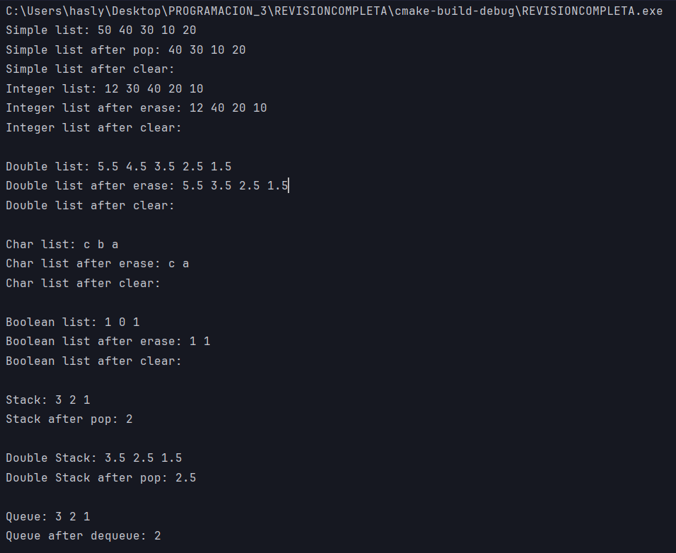

# REVISION COMPLETA DE LISTA SIMPLE, DOBLEMENTE ENLAZADA, STACK Y QUEUE

Una estructura en el lenguaje de programación C es una declaración de tipo de datos compuestos que define una lista de variables agrupadas físicamente bajo un nombre en un bloque de memoria

## Lista Simple

### DEFINICION

una lista enlazada es una de las estructuras de datos fundamentales, y puede ser usada para implementar otras estructuras de datos. Consiste en una secuencia de nodos, en los que se guardan campos de datos arbitrarios y una o dos referencias (punteros) al nodo anterior o posterior. El principal beneficio de las listas enlazadas respecto a los array convencionales es que el orden de los elementos enlazados puede ser diferente al orden de almacenamiento en la memoria o el disco, permitiendo que el orden de recorrido de la lista sea diferente al de almacenamiento.

### CODIGO DE LA LISTA SIMPLE
```cpp
template <typename Object>
class SLList {
private:
    //Estructura del nodo
    struct Node  {
        Object data;
        Node *next;//Anya

        //Constructor de copia
        Node(const Object &d = Object{}, Node *n = nullptr)
                : data{d}, next{n} {}

        //Constructor de referncia
        Node(Object &&d, Node *n = nullptr)
                : data{std::move(d)}, next{n} {}
    };

public:
    class iterator {
    public:
        //constructor implicito, se hace nulo el puntero
        iterator() : current{nullptr} {}

        //Operador * para darle forma a nuestro puntero
        Object &operator*() {
            if(current == nullptr)
                throw std::logic_error("Trying to dereference a null pointer.");
            return current->data;
        }

        //Movimiento
        //Operador para poder moverse por la lista
        iterator &operator++() {
            if(current)
                current = current->next;
            else
                throw std::logic_error("Trying to increment past the end.");
            return *this;
        }

        //Posicion
        //lee la posicion en la que va
        iterator operator++(int) {
            iterator old = *this;
            ++(*this);
            return old;
        }

        //Operadores para comparar
        bool operator==(const iterator &rhs) const {
            return current == rhs.current;
        }
        //Operador para decir que es diferente
        bool operator!=(const iterator &rhs) const {
            return !(*this == rhs);
        }

    private:
        //apunta al nodo al que estoy trabajando en ese momento
        Node *current;
        iterator(Node *p) : current{p} {}
        //la clase amigo de acceso a los atributos privados
        friend class SLList<Object>;
    };

public:
    //Dimencion de la lista
    //Se llama al nodo de la cabeza y la cola de la lista ya defina
    SLList() : head(new Node()), tail(new Node()), theSize(0) {
        head->next = tail;
    }

    //Destructor de la lista
    //Elimina el contenido comenzando con la cabeza, hasta la cola
    ~SLList() {
        clear();
        delete head;
        delete tail;
    }

    //Sirve para meter el iterador al principio o al final
    iterator begin() { return {head->next}; }
    iterator end() { return {tail}; }

    //El tamaño de nuestra lista para que el iterador pueda hacer el recorrido
    int size() const { return theSize; }
    bool empty() const { return size() == 0; }

    //Si la lista no esta vacía borra el objeto enfrente
    void clear() { while (!empty()) pop_front(); }

    //Si la lista esta vaciá da un error, si no vuelve al inicio
    Object &front() {
        if(empty())
            throw std::logic_error("List is empty.");
        return *begin();
    }

    //funcion de agregar por copia
    void push_front(const Object &x) { insert(begin(), x); }
    //funcion de agregar por referencia
    void push_front(Object &&x) { insert(begin(), std::move(x)); }

    //elimina el valo de en frente
    void pop_front() {
        if(empty())
            throw std::logic_error("List is empty.");
        erase(begin());
    }

    //Reciben un iterador para leer la posicion y insertar el dato en la pocision
    //Funcion por copia
    iterator insert(iterator itr, const Object &x) {
        Node *p = itr.current;
        head->next = new Node{x, head->next};
        theSize++;
        return iterator(head->next);
    }

    //Funcion por referencia
    iterator insert(iterator itr, Object &&x) {
        Node *p = itr.current;
        head->next = new Node{std::move(x), head->next};
        theSize++;
        return iterator(head->next);
    }

    //Toma el iterador para eliminar el dato en la posicion que le demos
    iterator erase(iterator itr) {
        if (itr == end())
            throw std::logic_error("Cannot erase at end iterator");
        Node *p = head;
        while (p->next != itr.current) p = p->next;
        p->next = itr.current->next;
        delete itr.current;
        theSize--;
        return iterator(p->next);
    }

    //Funcion para imprimir toda la lista
    void printList() {
        iterator itr = begin();
        while (itr != end()) {
            std::cout << *itr << " ";
            ++itr;
        }
        std::cout << std::endl;
    }

    void print() {
        iterator itr = begin();
        while (itr != end()) {
            std::cout << *itr << " ";
            ++itr;
        }
        std::cout << std::endl;
    }

private:
    Node *head;
    Node *tail;
    int theSize;
    void init() {
        theSize = 0;
        head->next = tail;
    }
};

```

## Lista Doblemente enlazada

### DEFINICION

Una lista doblemente enlazada es una lista lineal en la que cada nodo tiene dos enlaces, uno al nodo siguiente, y otro al anterior.

### CODIGO DE LA LISTA DOBLEMENTE ENLAZADA
```cpp 
#include <iostream>
#include <utility>

template <typename Object> //Plantilla que nos permite utilizar cualquier tipo de valor primitivo
class DLList{
protected:
    struct Node  {
        Object data;
        Node *next;
        Node *prev;

        //Constructor de copia
        Node(const Object &d = Object{}, Node *n = nullptr)
                : data{d}, next{n}, prev{n} {}

        //Constructor de referncia
        Node(Object &&d, Node *n = nullptr)
                : data{std::move(d)}, next{n}, prev{n} {}
    };

public:
    class iterator{
    public:
        //constructor implicito, con iterador nulo
        iterator() : current{nullptr} {}

        //Operador que se comporta como puntero
        Object &operator*() { // Iterador inicializado para marcar error en caso de falla logica
            if(current == nullptr)
                throw std::logic_error("Trying to dereference a null pointer.");
            return current->data;
        }

        //Movimiento
        // Iterador que permite que se mueva y le la información dentro del nodo
        iterator &operator++() {
            if(current)
                current = current->next;
            else
                throw std::logic_error("Trying to increment past the end.");
            return *this;
        }
        // Iterador que permite llevar el conteo
        iterator operator++(int) {
            iterator old = *this;
            ++(*this);
            return old;
        }
        // Permite restar valor al iterador
        iterator &operator--() {
            if(current)
                current = current->prev;
            else
                throw std::logic_error("Trying to decrease past the beginning.");
            return *this;
        }

        iterator &operator+(int addition){

            for(int i = 0; i<addition;i++){
                ++(*this);
            }
            return  *this;
        }

        iterator operator--(int) {
            iterator old = *this;
            --(*this);
            return old;
        }

        //Operadores para realizar comparaciones
        bool operator==(const iterator &rhs) const {
            return current == rhs.current;
        }

        bool operator!=(const iterator &rhs) const {
            return !(*this == rhs);
        }

    protected:
        //apunta al nodo al que estoy trabajando en ese momento
        Node *current;
        iterator(Node *p) : current{p} {}
        //la clase amigo de acceso a los atributos privados
        friend class DLList<Object>;
    };

public:
    //Define la dimension de la lista
    //Cuando se llame al constructor, ya tiene que estar una cabeza y una cola
    DLList() : head(new Node()), tail(new Node()), theSize(0) {
        head->next = tail;
    }

    //Destructor de la lista
    //Primero borra el contenido y despues la cola y la cabeza
    ~DLList() {
        clear();
        delete head;
        delete tail;
    }

    //Sirve para meter el iterador al principio o al final
    iterator begin() { return {head->next}; }
    iterator end() { return {tail}; }

    //el tamaño de la lista, para que un iterador sepa cuanto debe recorrer
    int size() const { return theSize; }
    bool empty() const { return size() == 0; }

    //Mientras no este vacia borra el objeto de en frente
    void clear() { while (!empty()) pop_front(); }

    //Si la lista esta vacia da un error, si no retorna el inicio
    Object &front() {
        if(empty())
            throw std::logic_error("List is empty.");
        return *begin();
    }

    //funcion de push por copia
    void push_front(const Object &x) { insert(begin(), x); }
    //funcion de push por referencia
    void push_front(Object &&x) { insert(begin(), std::move(x)); }

    void push_back(const Object &x) { insert(end(), x); }
    //funcion de push por referencia
    void push_back(Object &&x) { insert(end(), std::move(x)); }


    //elimina el valo de en frente
    void pop_front() {
        if(empty())
            throw std::logic_error("List is empty.");
        erase(begin());
    }

    //Recibe un iterador, lee esa posicion e inserta un código en la posicion que le demos
    //este funciona por copia
    iterator insert(iterator itr, const Object &x) {
        Node *p = itr.current;
        head->next = new Node{x, head->next};
        theSize++;
        return iterator(head->next);
    }

    //este funciona por referencia
    iterator insert(iterator itr, Object &&x) {
        Node *p = itr.current;
        head->next = new Node{std::move(x), head->next};
        theSize++;
        return iterator(head->next);
    }

    //esta funcion nos ayuda a recibir un iterador y después volverlo un int
    void insert(int pos, const Object &x) {
        insert(get_iterator(pos), x);
    }

    //Aqui es donde el iterador se vuelve un entero
    iterator get_iterator(int a)
    {
        iterator it = begin();
        for(int i = 0; i != a; ++i) {
            ++it;
        }
        return it;
    }

    //recibe un iterador y borra el dato en la posicion que le digamos
    iterator erase(iterator itr) {

        if (itr == end())
            throw std::logic_error("Cannot erase at end iterator");
        Node *p = head;
        while (p->next != itr.current) p = p->next;
        p->next = itr.current->next;
        delete itr.current;
        theSize--;
        return iterator(p->next);
    }
    //llama a getiterator por si pasan un entero otra vez
    void erase(int pos)
    {
        erase(get_iterator(pos));
    }

    //Getter para toda la lista
    void print() {
        iterator itr = begin();
        while (itr != end()) {
            std::cout << *itr << " ";
            ++itr;
        }
        std::cout << std::endl;
    }


protected:
    Node *head;
    Node *tail;
    int theSize;
    //init necesita acceso a los datos privados para inicializar una lista vacia
    void init() {
        theSize = 0;
        head->next = tail;
    }
};
```

## STACK (PILA)

### DEFINICION

Es una estructura de datos en la que el modo de acceso a sus elementos es de tipo LIFO (del inglés Last In First Out, último en entrar, primero en salir) que permite almacenar y recuperar datos.

### CODIGO DE LA PILA

```cpp
#include "DLList.h"
template <typename Iterator>
class Stack : private DLList<Iterator> {
public:
    Stack() {
    }

    ~Stack(){
        clear();
        delete DLList<Iterator>::head;
        delete DLList<Iterator>::tail;
    }

    void push(Iterator &data){
        DLList<Iterator>::push_front(data);
    }
    void push(Iterator &&data){
        DLList<Iterator>::push_front(data);
    }

    void pop(){
        DLList<Iterator>::pop_front();
    }

    void clear(){
        DLList<Iterator>::clear();
    }

    void print(){
        DLList<Iterator>::print();
    }

    Iterator top(){
        return DLList<Iterator>::head->next->data;
    }
};
```

## QUEUE (COLA)

### DEFINICION

Una clase de adaptador de contenedor de plantilla que proporciona una restricción de la función de algunos tipos de contenedor subyacentes y que limita el acceso a los elementos frontal y trasero. Los elementos pueden agregarse en la parte trasera o quitarse de la parte delantera, y pueden inspeccionarse en cualquier extremo de queue.

### CODIGO DE LA COLA

```cpp
#include "DLList.h"

template<typename XD>
class Queue : private DLList<XD>{
public:
    Queue(){
    }

    ~Queue(){
        clear();
        delete DLList<XD>::head;
        delete DLList<XD>::tail;
    }

    void enqueue(XD &data){
        DLList<XD>::push_back(data);
    }

    void enqueue(XD &&data){
        DLList<XD>::push_back(data);
    }

    void dequeue(){
        DLList<XD>::pop_front();
    }

    void print(){
        DLList<XD>::print();
    }

    void clear(){
        DLList<XD>::clear();
    }

    XD front(){
        return DLList<XD>::head->next->data;
    }
};
```

## MAIN FUNCIONAL 

